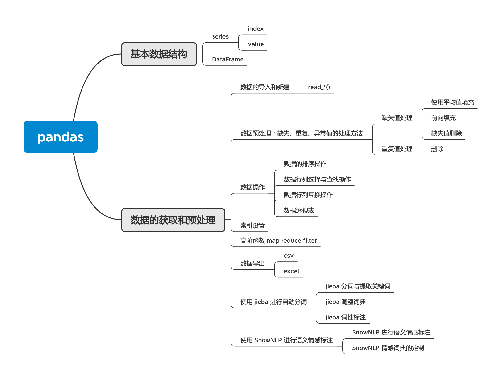
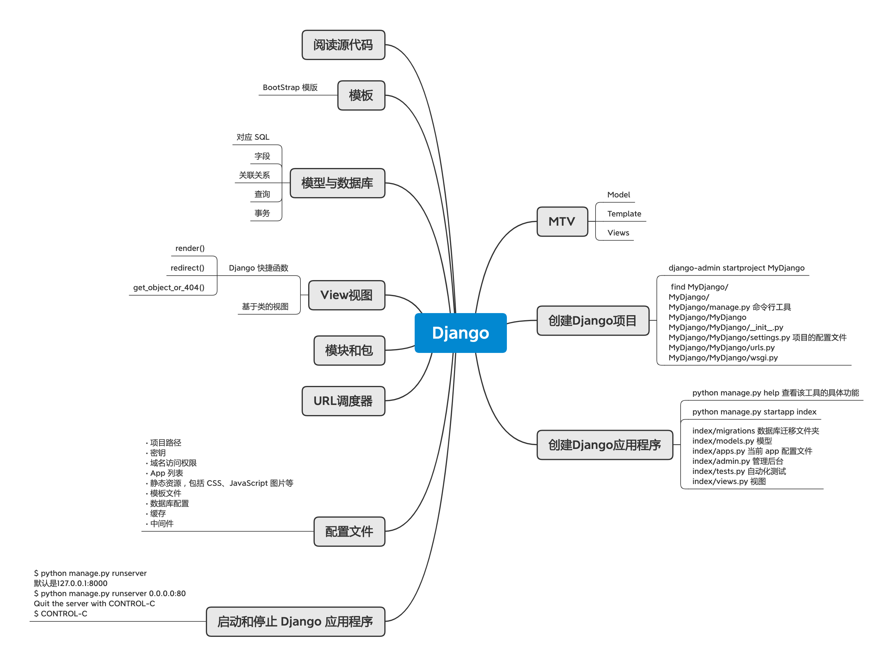
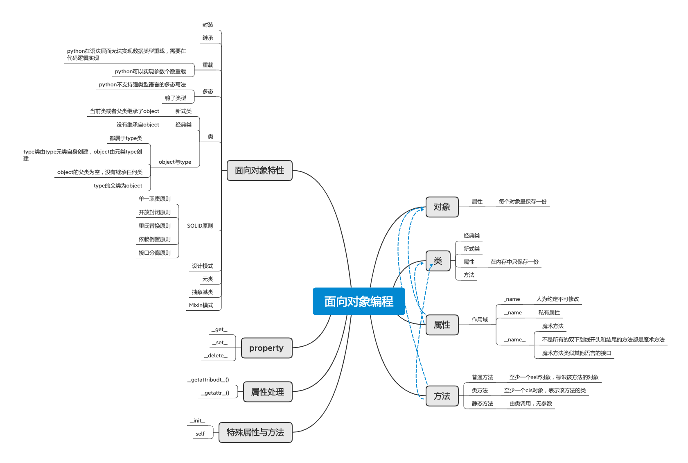

## 学习总结 
转眼间时间过去了，到了总结的时间。磕磕绊绊每次的课程都阅读了，作业也提交了，但是感觉自己的学习还是有非常多的不足，到了后面的课程因为前面有一些欠账，所以作业的质量和完成度都有所欠缺。
另一方面，感觉训练营的课程稍微有点主线不够突出，不过老师很大方的给出了新一期训练营的课程，新一期的课程的安排总体上就清晰了许多。
经过这一段时间的学习，还是有很多收获的，我把自己总结的相关内容整理成思维导图放在下面

