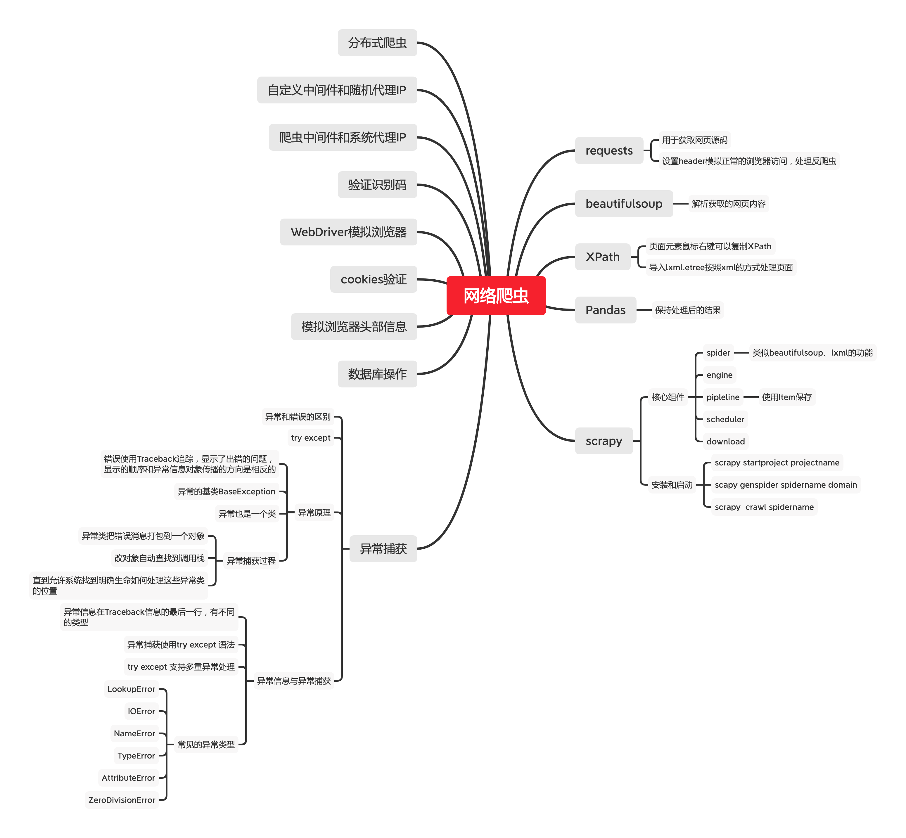

# 网络爬虫

## requests

### 用于获取网页源码

### 设置header模拟正常的浏览器访问，处理反爬虫

## beautifulsoup

### 解析获取的网页内容

## XPath

### 页面元素鼠标右键可以复制XPath

### 导入lxml.etree按照xml的方式处理页面

## Pandas

### 保持处理后的结果

## scrapy

### 核心组件

- spider

	- 类似beautifulsoup、lxml的功能

- engine
- pipleline

	- 使用Item保存

- scheduler
- download

### 安装和启动

- scrapy startproject projectname
- scapy genspider spidername domain
- scrapy  crawl spidername

## 异常捕获

### 异常和错误的区别

### try except

### 异常原理

- 错误使用Traceback追踪，显示了出错的问题，显示的顺序和异常信息对象传播的方向是相反的
- 异常的基类BaseException
- 异常也是一个类
- 异常捕获过程

	- 异常类把错误消息打包到一个对象
	- 改对象自动查找到调用栈
	- 直到允许系统找到明确生命如何处理这些异常类的位置

### 异常信息与异常捕获

- 异常信息在Traceback信息的最后一行，有不同的类型
- 异常捕获使用try except 语法
- try except 支持多重异常处理
- 常见的异常类型

	- LookupError
	- IOError
	- NameError
	- TypeError
	- AttributeError
	- ZeroDivisionError

## 数据库操作

## 模拟浏览器头部信息

## cookies验证

## WebDriver模拟浏览器

## 验证识别码

## 爬虫中间件和系统代理IP

## 自定义中间件和随机代理IP

## 分布式爬虫

