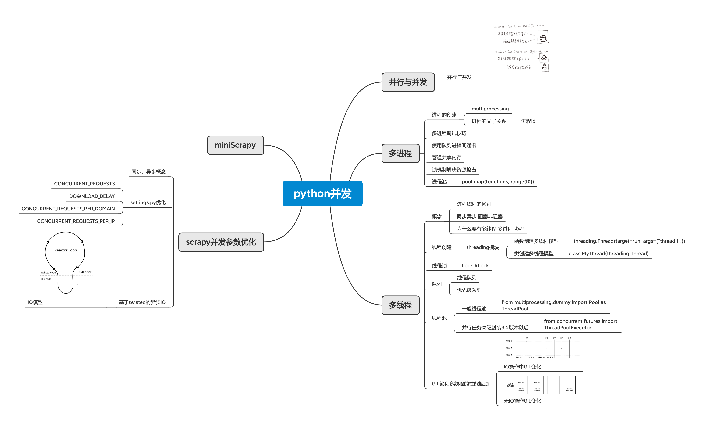

# python并发
## scrapy并发参数优化

### 同步、异步概念

### settings.py优化

- CONCURRENT_REQUESTS
- DOWNLOAD_DELAY
- CONCURRENT_REQUESTS_PER_DOMAIN
- CONCURRENT_REQUESTS_PER_IP

### 基于twisted的异步IO

- IO模型

## miniScrapy

## 并行与并发

### 并行与并发

## 多进程

### 进程的创建

- multiprocessing
- 进程的父子关系

	- 进程id

### 多进程调试技巧

### 使用队列进程间通讯

### 管道共享内存

### 锁机制解决资源抢占

### 进程池

- pool.map(functions, range(10))

## 多线程

### 概念

- 进程线程的区别
- 同步异步 阻塞非阻塞
- 为什么要有多线程 多进程 协程

### 线程创建

- threading模块

	- 函数创建多线程模型

		- threading.Thread(target=run, args=("thread 1",))

	- 类创建多线程模型

		- class MyThread(threading.Thread)

### 线程锁

- Lock RLock

### 队列

- 线程队列
- 优先级队列

### 线程池

- 一般线程池

	- from multiprocessing.dummy import Pool as ThreadPool

- 并行任务高级封装3.2版本以后

	- from concurrent.futures import ThreadPoolExecutor

### GIL锁和多线程的性能瓶颈

- IO操作中GIL变化
- 无IO操作GIL变化

