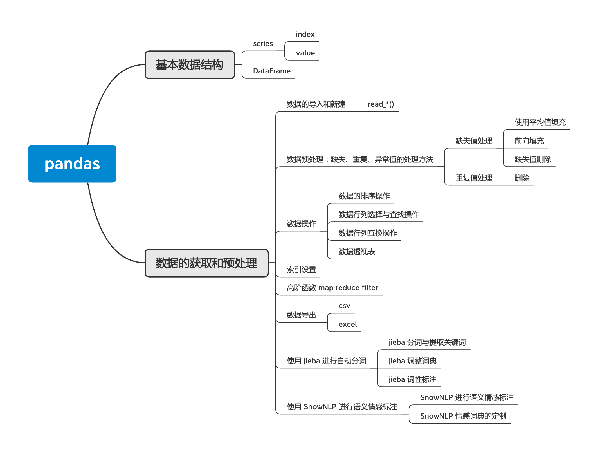

# pandas

## 基本数据结构

### series

- index
- value

### DataFrame

## 数据的获取和预处理

### 数据的导入和新建

- read_*()

### 数据预处理：缺失、重复、异常值的处理方法

- 缺失值处理

	- 使用平均值填充
	- 前向填充
	- 缺失值删除

- 重复值处理

	- 删除

### 数据操作

- 数据的排序操作
- 数据行列选择与查找操作
- 数据行列互换操作
- 数据透视表

### 索引设置

### 高阶函数 map reduce filter

### 数据导出

- csv
- excel

### 使用 jieba 进行自动分词

- jieba 分词与提取关键词
- jieba 调整词典
- jieba 词性标注

### 使用 SnowNLP 进行语义情感标注

- SnowNLP 进行语义情感标注
- SnowNLP 情感词典的定制

