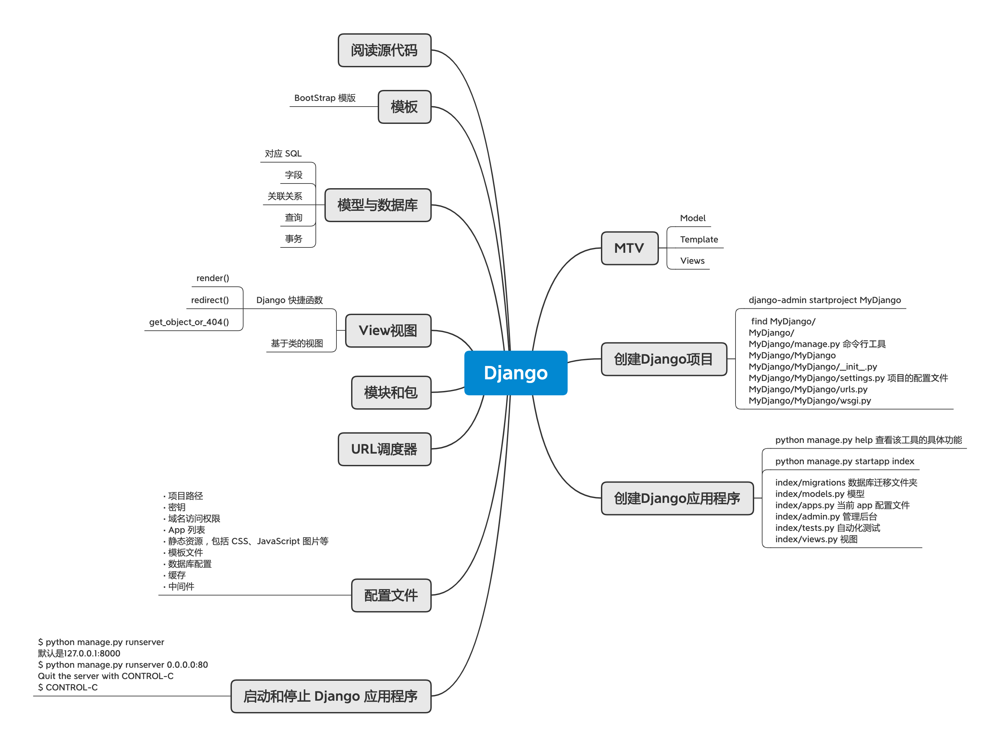

# Django

## MTV

### Model

### Template

### Views

## 创建Django项目

### django-admin startproject MyDjango

###  find MyDjango/
MyDjango/
MyDjango/manage.py 命令⾏⼯具
MyDjango/MyDjango
MyDjango/MyDjango/__init__.py
MyDjango/MyDjango/settings.py 项⽬的配置⽂件
MyDjango/MyDjango/urls.py
MyDjango/MyDjango/wsgi.py

## 创建Django应用程序

### python manage.py help 查看该工具的具体功能

### python manage.py startapp index

### index/migrations 数据库迁移文件夹
index/models.py 模型
index/apps.py 当前 app 配置文件
index/admin.py 管理后台
index/tests.py 自动化测试
index/views.py 视图

## 启动和停止 Django 应用程序

### $ python manage.py runserver
默认是127.0.0.1:8000
$ python manage.py runserver 0.0.0.0:80
Quit the server with CONTROL-C
$ CONTROL-C

## 配置文件

### • 项目路径
• 密钥
• 域名访问权限
• App 列表
• 静态资源，包括 CSS、JavaScript 图片等
• 模板文件
• 数据库配置
• 缓存
• 中间件

## URL调度器

## 模块和包

## View视图

### Django 快捷函数

- render()
- redirect()
- get_object_or_404()

### 基于类的视图

## 模型与数据库

### 对应 SQL

### 字段

### 关联关系

### 查询

### 事务

## 模板

### BootStrap 模版

## 阅读源代码

