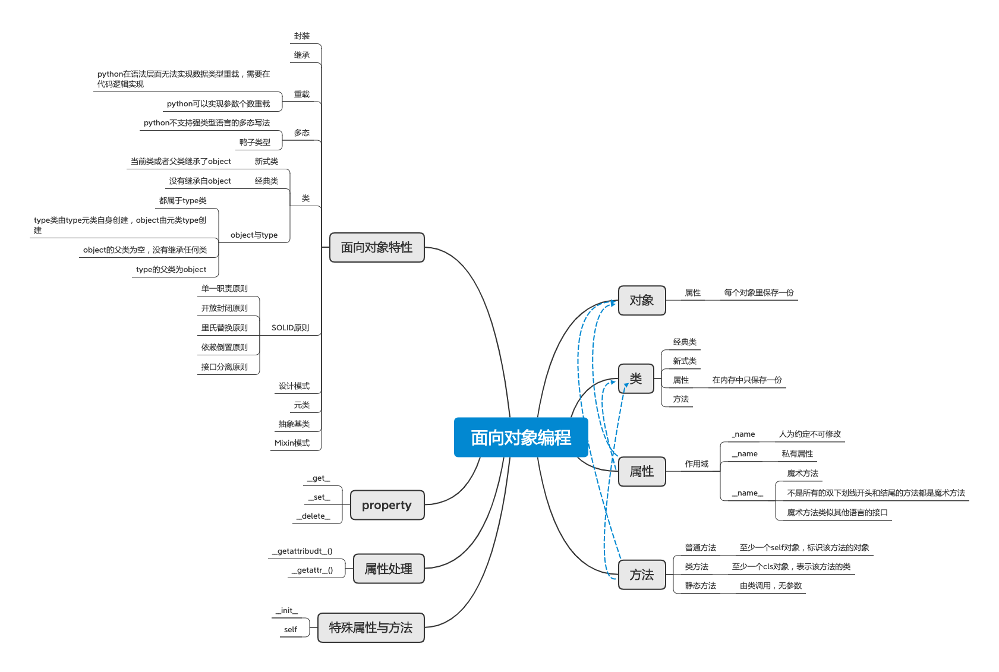

# 面向对象编程

## 对象

### 属性

- 每个对象里保存一份

## 类

### 经典类

### 新式类

### 属性

- 在内存中只保存一份

### 方法

## 属性

### 作用域

- _name

	- 人为约定不可修改

- __name

	- 私有属性

- __name__

	- 魔术方法
	- 不是所有的双下划线开头和结尾的方法都是魔术方法
	- 魔术方法类似其他语言的接口

## 方法

### 普通方法

- 至少一个self对象，标识该方法的对象

### 类方法

- 至少一个cls对象，表示该方法的类

### 静态方法

- 由类调用，无参数

## 特殊属性与方法

### __init__

### self

## 属性处理

### __getattribudt__()

### __getattr__()

## property

### __get__

### __set__

### __delete__

## 面向对象特性

### 封装

### 继承

### 重载

- python在语法层面无法实现数据类型重载，需要在代码逻辑实现
- python可以实现参数个数重载

### 多态

- python不支持强类型语言的多态写法
- 鸭子类型

### 类

- 新式类

	- 当前类或者父类继承了object

- 经典类

	- 没有继承自object

- object与type

	- 都属于type类
	- type类由type元类自身创建，object由元类type创建
	- object的父类为空，没有继承任何类
	- type的父类为object

### SOLID原则

- 单一职责原则
- 开放封闭原则
- 里氏替换原则
- 依赖倒置原则
- 接口分离原则

### 设计模式

### 元类

### 抽象基类

### Mixin模式

